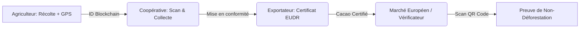

# 🍫 ChainCacao - Système de Traçabilité Intégral

ChainCacao est une plateforme technologique conçue pour sécuriser la filière cacao au Togo. Elle garantit la **non-déforestation (Conformité EUDR)** et une traçabilité immuable grâce à la technologie Blockchain.

---

## 👥 Les Acteurs & Rôles

Le système simule l'interaction entre quatre types d'utilisateurs clés :

### 1. L'Agriculteur / Producteur (Terrain)
*   **Outil :** Application Mobile
*   **Actions :** 
    *   Enregistre sa récolte.
    *   Sélectionne la variété de cacao (Criollo, Forastero, Trinitario).
    *   **Capture GPS :** Fixe les coordonnées exactes de sa parcelle pour prouver qu'il ne cultive pas dans une zone protégée.
    *   **Ancrage Blockchain :** Génère un ID unique ancré sur Polygon.

### 2. Le Responsable de Coopérative (Gestionnaire)
*   **Outil :** Application Mobile & Web
*   **Actions :** 
    *   **Scanner de Collecte :** Utilise son téléphone pour scanner les sacs lors de la collecte.
    *   **Validation des transferts :** Change le statut du lot de "Récolté" à "En transit".
    *   **Suivi des volumes :** Visualise les tonnes collectées par zone géographique.

### 3. L'Exportateur (Garant de la conformité)
*   **Outil :** Portail Web Professionnel
*   **Actions :** 
    *   Vérifie l'intégrité des données GPS reçues du terrain.
    *   **Génération de Certificat EUDR :** Produit le document légal nécessaire pour l'entrée sur le marché européen.
    *   Prépare l'expédition internationale.

### 4. Le Vérificateur / Client Final (Audit & Transparence)
*   **Outil :** Portail Web / Public
*   **Actions :** 
    *   Vérifie l'ID d'un lot pour voir son historique complet.
    *   Consulte l'**Odyssée du Cacao** (Chronologie : Récolte ➔ Fermentation ➔ Transport ➔ Export).
    *   Vérifie la preuve immuable sur l'explorateur blockchain.

---

## 🔄 Le Flux Opérationnel (L'Odyssée du Cacao)

1.  **Origine :** L'agriculteur crée le lot sur le terrain. Le GPS est obligatoire (Critère EUDR 2025).
2.  **Centralisation :** La coopérative valide la réception physique.
3.  **Certification :** L'exportateur compile les preuves numériques.
4.  **Confiance :** L'acheteur final accède à la vérité du produit en un clic.

---

## 🛠 Architecture Technique

*   **Frontend :** HTML5, Tailwind CSS (Design Premium & Responsive).
*   **Backend :** Firebase (Authentification & Firestore pour le temps réel).
*   **Blockchain :** Simulation d'ancrage Polygon (Hash immuable généré pour chaque lot).
*   **Mobile-First :** Interface optimisée pour les zones rurales avec mode de données léger.

---

## 🚀 Déploiement

Le projet est structuré pour être déployé sur **Netlify** via le dossier `dist/` :
*   **Site Vitrine :** `/index.html`
*   **Portail Pro :** `/portal.html`
*   **App Mobile :** `/mobile-app/index.html`

---

**ChainCacao — Sécuriser l'or brun du Togo par la transparence numérique.**
*Projet réalisé par l'équipe TG-26.*
